# Project: Standardization of Agricultural and Agro-industrial Standards Data

This project involves the standardization of agricultural and agro-industrial standards data. The following conceptual data model describes the entities, their attributes, and relationships, aiming for consistency and clarity.

### Conceptual Data Model (Standardized Field Names)

#### 1. `business_profile` (from `business_profiles.data.json`)

Represents individual business profiles.

*   **`rut`**: (String, **Primary Key**) - Rol Único Tributario del negocio.
*   `commune`: (String) - La comuna o distrito donde se encuentra el negocio.
*   `digital_tools_used_at_work`: (Array of Strings) - Herramientas digitales utilizadas por el negocio.
*   `business_size`: (String) - Tamaño del negocio basado en las ventas anuales.
*   `legal_name`: (String) - La razón social del negocio.
*   `address`: (String) - La dirección física del negocio.
*   `region`: (String) - La región donde se encuentra el negocio.
*   `owner_phone`: (String) - El número de teléfono del propietario o persona de contacto del negocio.
*   `process_type`: (String) - El tipo de proceso de producción que utiliza el negocio.
*   `owner_email`: (String) - La dirección de correo electrónico del propietario o persona de contacto.
*   `owner_role`: (String) - El rol o título del propietario/persona de contacto.
*   `digital_tools_experienced`: (Array of Strings) - Una lista de herramientas digitales con las que el propietario/persona de contacto tiene experiencia.
*   `owner_name`: (String) - El nombre del propietario o persona de contacto del negocio.

#### 2. `standard_template` (from `surveys_templates.data.json`)

Represents the master templates for different types of standards.

*   **`template_name`**: (String, **Conceptual Primary Key**) - Un identificador implícito para la plantilla (e.g., "ciruelas-aa").
*   `description`: (String) - Descripción de la plantilla (del esquema).
*   `questions`: (Array of `standard_question_template` objects) - Contiene la estructura detallada de cada pregunta dentro de la plantilla.

#### 3. `standard_question_template` (nested within `standard_template`)

Represents individual questions or standards defined within a `standard_template`. This is the **canonical source** for standard definitions.

*   **`standard_code`**: (String, **Primary Key within `standard_template`**) - Identificador único y orientado al negocio para la pregunta/estándar (e.g., 'A001', 'P001').

*   `level`: (String) - El nivel del estándar.
*   `dimension`: (String) - La dimensión o categoría principal a la que pertenece la pregunta.
*   `theme`: (String) - El tema específico dentro de la dimensión.
*   `action`: (String) - La acción específica tomada para cumplir con el estándar.
*   `good_practice`: (String) - Describe la buena práctica relacionada con la pregunta.
*   `verification_medium`: (String) - Describe el *contenido esperado* de la verificación (e.g., "Registro de consumo de agua mensual").
*   `verification_type`: (String) - El *tipo esperado* de evidencia de verificación (e.g., "Foto", "Archivo", "Bitácora").
*   `valid_answers`: (Array of Mixed, *Optional*) - Una lista de respuestas válidas predefinidas para esta pregunta.
*   `question`: (String, *Optional*) - El texto de la pregunta.
*   `points`: (Integer) - Puntos asociados al estándar.
*   `linked_resources`: (Array of Strings, *Optional*) - Una lista de valores `resource_code` para los recursos relacionados con esta pregunta.
*   `link`: (String, *Optional*) - Una URL a información adicional o recursos relacionados con el estándar.

#### 4. `standard_response` (from `surveys.data.json`)

Stores individual standard responses from businesses.

*   **`business_rut`**: (String, **Primary Key**, **Foreign Key** to `business_profile.rut`) - El RUT del negocio que respondió al estándar.
*   `is_completed`: (Boolean) - Un indicador que muestra si el estándar ha sido completado.
*   `date`: (Timestamp) - La fecha y hora en que el estándar fue actualizado o completado por última vez.
*   `answers`: (Array of `standard_answer` objects) - Contiene las respuestas a las preguntas del estándar.

#### 5. `standard_answer` (nested within `standard_response`)

Represents an individual answer to a standard question.

*   **`standard_code`**: (String, **Primary Key within `standard_response`**, **Foreign Key** to `standard_question_template.standard_code`) - El identificador de la pregunta que se está respondiendo.
*   `answer_value`: (Mixed) - La respuesta real proporcionada por el usuario (el tipo de dato depende de la pregunta).
*   `register_id`: (Integer, **Foreign Key** to `register.id`, *Optional*) - Enlace a la entrada de `register` asociada para la verificación de esta respuesta.

#### 6. `register` (from `registros_aa.csv`, `registros_pp.csv` and merged `uploaded_verification_media`)

Represents a recorded compliance item, now including details about the uploaded verification media and its validation.

*   **`id`**: (Integer, **Primary Key**) - Identificador único para esta instancia específica de registro/verificación.
*   **`business_rut`**: (String, **Foreign Key** to `business_profile.rut`) - El RUT del negocio asociado con este registro.
*   **`standard_code`**: (String, **Foreign Key** to `standard_question_template.standard_code`) - El identificador de la pregunta para la que es este registro.
*   `folder`: (String, *Optional*) - Ruta o identificador de la carpeta donde se almacenan los archivos asociados.
*   `log`: (String, *Optional*) - Un registro o bitácora de actividades relacionadas con la verificación.
*   `upload_timestamp`: (Timestamp, *Optional*) - La fecha y hora en que se cargaron/registraron los datos de verificación.
*   `validation_status`: (String, *Optional*) - Estado actual de la verificación (e.g., "pending", "validated", "rejected").
*   `validation_timestamp`: (Timestamp, *Optional*) - La fecha y hora en que ocurrió la validación.
*   `auditor_id`: (Integer, **Foreign Key** to `auditor.auditor_id`, *Optional*) - El auditor que realizó la validación.
*   `auditor_comments`: (String, *Optional*) - Cualquier comentario proporcionado by el auditor durante la validación.

#### 7. `resource` (from `recursos_aa.csv`, `recursos_pp.csv`)

Represents available resources for standards.

*   **`resource_code`**: (String, **Primary Key**) - Un identificador único para esta instancia de recurso específica.

*   `type`: (String) - Tipo de recurso.
*   `detail`: (String) - Descripción detallada del recurso.
*   `url`: (String) - Una única URL para el recurso.

---

#### **New Entity: `auditor`**

Represents an auditor who validates uploaded verification media.

*   **`auditor_id`**: (Integer, **Primary Key**) - Identificador único para el auditor.
*   `auditor_name`: (String) - Nombre del auditor.
*   `auditor_email`: (String, *Optional*) - Dirección de correo electrónico del auditor.

---

### Relationships Summary (Updated):

*   `business_profile` 1 -- M `standard_response` (via `rut` / `business_rut`)
*   `standard_template` 1 -- M `standard_question_template` (conceptual containment)
*   `standard_response` 1 -- M `standard_answer` (conceptual containment)
*   `standard_question_template` 1 -- M `register` (via `standard_code`)
*   `standard_question_template` 1 -- M `standard_answer` (via `standard_code`)
*   `standard_answer` 1 -- 0..1 `register` (via `register_id`)
*   `auditor` 1 -- M `register` (via `auditor_id`)
*   `resource` M -- M `standard_question_template` (via `resource_code` / `standard_code`)

### Entity Relationship Diagram

```mermaid
erDiagram
    business_profile ||--|{ standard_response : "has"
    standard_template ||--|{ standard_question_template : "contains"
    standard_response ||--|{ standard_answer : "contains"
    standard_question_template ||--|{ register : "has"
    standard_question_template ||--|{ standard_answer : "has"
    standard_answer |o--|| register : "verifies"
    auditor ||--|{ register : "validates"
    resource }|--|{ standard_question_template : "linked to"

    business_profile {
        string rut PK
        string commune
        string digital_tools_used_at_work
        string business_size
        string legal_name
        string address
        string region
        string owner_phone
        string process_type
        string owner_email
        string owner_role
        string digital_tools_experienced
        string owner_name
    }

    standard_template {
        string template_name PK
        string description
    }

    standard_question_template {
        string standard_code PK
        string level
        string dimension
        string theme
        string action
        string good_practice
        string verification_medium
        string verification_type
        string valid_answers
        string question
        int points
        string linked_resources
        string link
    }

    standard_response {
        string business_rut PK, FK
        bool is_completed
        timestamp date
    }

    standard_answer {
        string standard_code PK, FK
        string answer_value
        int register_id FK
    }

    register {
        int id PK
        string business_rut FK
        string standard_code FK
        string folder
        string log
        timestamp upload_timestamp
        string validation_status
        timestamp validation_timestamp
        int auditor_id FK
        string auditor_comments
    }

    resource {
        string resource_code PK
        string type
        string detail
        string url
    }

    auditor {
        int auditor_id PK
        string auditor_name
        string auditor_email
    }
```

