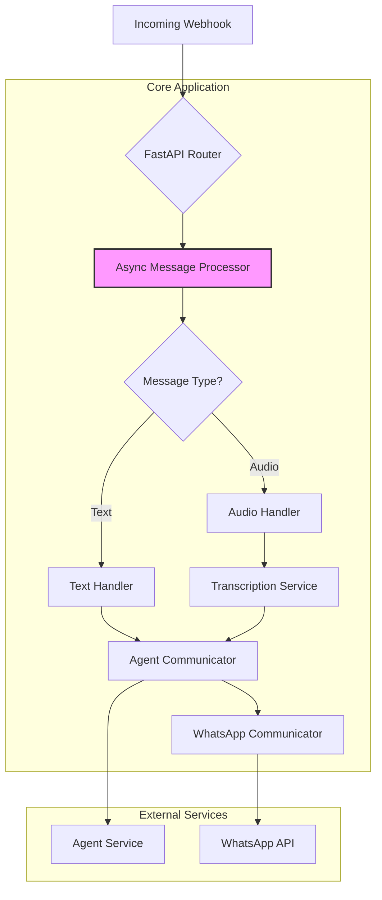

# Refactoring and Improvement Proposal

## 1. Executive Summary

This document outlines a comprehensive refactoring plan to enhance the WhatsApp webhook application's architecture. The current implementation, while functional, can be significantly improved in terms of code organization, performance, and maintainability.

The key proposals are:

- **Centralize Configuration**: Consolidate all environment variables and configuration logic into a single, unified module.
- **Simplify Core Logic**: Refactor the message processing pipeline to be more modular, asynchronous, and easier to extend.
- **Optimize Performance**: Reduce startup time and request latency by minimizing runtime imports and leveraging asynchronous operations more effectively.
- **Standardize Message Handling**: Implement a clear and consistent pattern for processing all message types, including text and audio.

By implementing these changes, we will create a more robust, scalable, and developer-friendly application that is better suited for deployment in a high-performance environment like Google Cloud Platform (GCP).

## 2. Current State Analysis & Proposed Changes

### 2.1. Code Organization and Complexity

**Problem**: The current codebase has several modules for configuration (`config.py`, `app_config.py`) and a complex `messages.py` file that mixes responsibilities, leading to code that is difficult to follow and maintain.

**Proposal**:

1.  **Unified Configuration**: Merge `config.py` and `app_config.py` into a single, authoritative `app_config.py`. This module will expose a singleton `config` object that provides access to all application settings.
2.  **Modular Processing**: Decompose the monolithic `messages.py` into smaller, more focused modules with clear responsibilities:
    -   `message_parser.py`: For parsing incoming webhook payloads.
    -   `message_processor.py`: For handling the business logic of different message types.
    -   `agent_communicator.py`: For interacting with the external agent service.
    -   `whatsapp_communicator.py`: For sending messages back to the user via the WhatsApp API.

### 2.2. Performance and Scalability

**Problem**: The application's performance can be impacted by runtime imports and synchronous I/O operations, which can increase latency, especially under load.

**Proposal**:

1.  **Minimize Runtime Imports**: Move all imports to the top level of each module to reduce the overhead of import operations during request fulfillment.
2.  **Embrace Asynchronicity**: Convert all I/O-bound operations (e.g., HTTP requests to external services) to use `async/await` with `httpx`. This will allow the application to handle more concurrent requests efficiently.
3.  **Streamlined Audio Processing**: Optimize the audio processing pipeline by making the entire flow asynchronous, from downloading the media to sending the transcribed text to the agent.

### 2.3. WhatsApp Message Processing

**Problem**: While the application handles text and audio messages, the implementation can be made more robust and extensible to support other message types in the future.

**Proposal**:

1.  **Standardized Message Handling**: Implement a `MessageHandler` protocol (interface) that defines a standard way to process different message types. This will make it easy to add new handlers for images, documents, or other formats.
2.  **Improved Error Handling**: Implement a consistent error handling strategy across the application, with specific exceptions for different types of failures (e.g., `AgentError`, `WhatsAppError`).
3.  **Centralized Logic**: Consolidate the core message processing logic into a single `process_message` function that orchestrates the parsing, handling, and response generation for all message types.

## 3. Proposed Architecture

The following diagram illustrates the proposed high-level architecture:

## 4. Detailed Implementation Plan

### Phase 1: Configuration and Core Refactoring

1.  **Centralize Configuration**:
    -   Merge `config.py` into `app_config.py`.
    -   Update all modules to import the `config` object from `app_config.py`.
2.  **Refactor `messages.py`**:
    -   Create the new `message_parser.py`, `message_processor.py`, `agent_communicator.py`, and `whatsapp_communicator.py` modules.
    -   Move the relevant logic from `messages.py` into the new modules.
3.  **Update Entrypoints**:
    -   Refactor `main.py` and `api/webhooks.py` to use the new, simplified message processing functions.

### Phase 2: Asynchronous I/O and Performance

1.  **Convert to `async`**:
    -   Ensure all functions that perform I/O are defined with `async def`.
    -   Use `await` for all I/O-bound calls.
2.  **Optimize Imports**:
    -   Move all imports to the top of each file.
3.  **Refactor Audio Handling**:
    -   Rewrite the `handle_audio_message` function to be fully asynchronous.

### Phase 3: Standardize Message Handling

1.  **Implement `MessageHandler` Protocol**:
    -   Define a `MessageHandler` protocol with a `handle` method.
    -   Create concrete implementations for `TextMessageHandler` and `AudioMessageHandler`.
2.  **Create a Message Handler Registry**:
    -   Implement a simple registry to map message types to their corresponding handlers.
3.  **Update `process_message`**:
    -   Refactor the `process_message` function to use the registry to dynamically select the correct handler for each message type.

## 5. Conclusion

This refactoring plan will significantly improve the quality, performance, and maintainability of the WhatsApp webhook application. By centralizing configuration, simplifying the core logic, and optimizing for performance, we will create a more robust and scalable solution that is well-prepared for future growth and new features.
