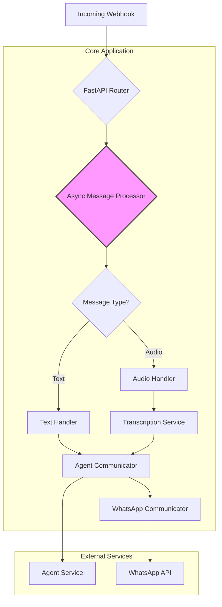

# Refactoring and Improvement Proposal v2

## 1. Executive Summary

This document outlines a targeted refactoring plan to further enhance the WhatsApp webhook application. The current architecture is modular and well-structured, but there are several opportunities to improve performance, reduce complexity, and increase robustness.

The key proposals are:

- **Simplify and Unify Message Processing**: Consolidate the message processing logic into a single, streamlined workflow that eliminates redundant code and improves clarity.
- **Optimize for Performance**: Enhance the application's performance by leveraging asynchronous operations more effectively and minimizing unnecessary I/O.
- **Improve Configuration Management**: Refine the configuration model to be more intuitive and easier to manage.

By implementing these changes, we will create a more efficient, maintainable, and scalable application.

## 2. Proposed Changes

### 2.1. Unify Message Processing Logic

**Problem**: The current implementation has separate functions for processing text and non-text messages (`_process_single_text_message` and `_process_non_text_message`), which leads to some code duplication and makes the overall workflow harder to follow.

**Proposal**:

- **Consolidate into a Single Processor**: Create a single `process_message` function that handles all message types. This function will use a `match` statement (or a more extensible pattern like a handler registry) to delegate to type-specific logic, reducing code duplication and improving clarity.
- **Streamline the Workflow**: The new `process_message` function will be responsible for the entire message lifecycle, from parsing and session management to agent communication and sending the final response.

### 2.2. Enhance Performance and Asynchronicity

**Problem**: The current implementation uses the synchronous `requests` library for all HTTP calls, which can block the event loop and limit the application's ability to handle concurrent requests efficiently.

**Proposal**:

- **Embrace `httpx` for All I/O**: Replace all instances of `requests` with the asynchronous `httpx` library. This will ensure that all I/O operations are non-blocking, significantly improving performance under load.
- **Optimize Audio Processing**: Refactor the `handle_audio_message` function to be fully asynchronous, from downloading the media to sending the transcribed text to the agent.

### 2.3. Refine Configuration Management

**Problem**: The current configuration model in `app_config.py` is functional but can be made more intuitive and easier to use.

**Proposal**:

- **Simplify the `WhatsAppConfig` Class**: Refactor the `WhatsAppConfig` class to be a simple data container, removing the methods that fetch environment variables. This will make the configuration easier to understand and test.
- **Centralize Environment Variable Access**: Move all `os.getenv` calls to the `AppConfig` class, making it the single source of truth for all environment-based configuration.

## 3. Proposed Architecture

The following diagram illustrates the proposed high-level architecture:

## 4. Detailed Implementation Plan

### Phase 1: Core Refactoring

1.  **Refactor `messages.py`**:
    -   Create the new, unified `process_message` function.
    -   Move the logic from `_process_single_text_message` and `_process_non_text_message` into the new function.
    -   Remove the old, now-redundant functions.
2.  **Update `api/webhooks.py`**:
    -   Refactor the webhook handlers to call the new `process_message` function.

### Phase 2: Performance and Asynchronicity

1.  **Replace `requests` with `httpx`**:
    -   Update all external service clients to use `httpx` for all HTTP requests.
2.  **Refactor `handle_audio_message`**:
    -   Rewrite the function to be fully asynchronous.

### Phase 3: Configuration Management

1.  **Refactor `app_config.py`**:
    -   Simplify the `WhatsAppConfig` class.
    -   Move all `os.getenv` calls to the `AppConfig` class.

## 5. Conclusion

This refactoring plan will result in a more performant, maintainable, and scalable application. By simplifying the core logic, embracing asynchronicity, and improving configuration management, we will create a more robust and developer-friendly codebase.
