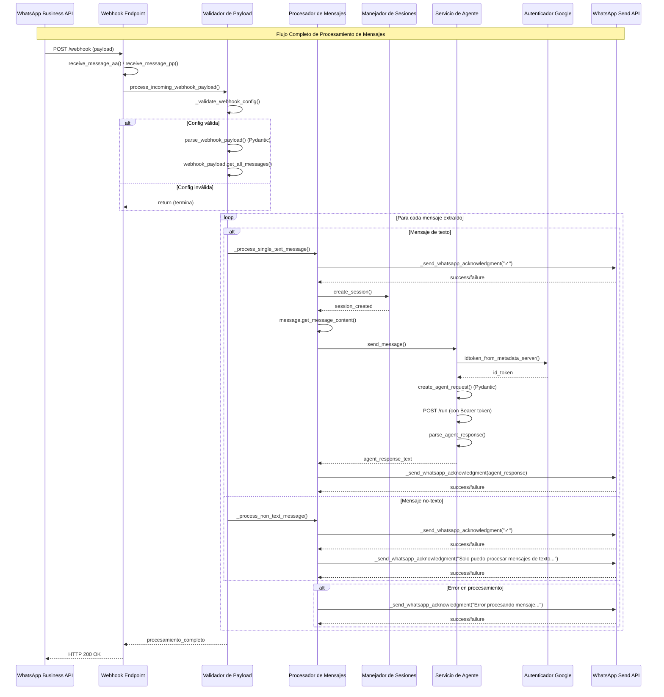
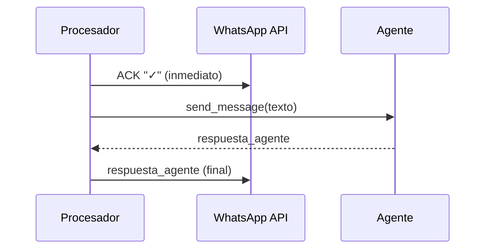
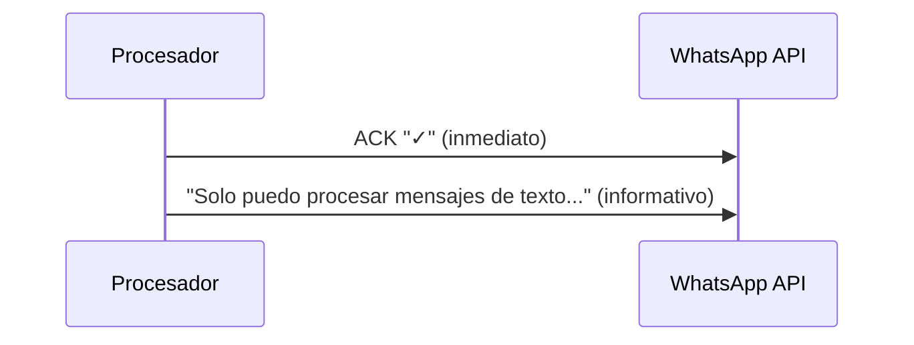

# Diagrama de Secuencia - Procesamiento de Mensajes WhatsApp

## 📋 Flujo Principal de Mensajes



## 🔧 Detalles Técnicos del Flujo

### 1. **Entrada del Webhook**
```
WhatsApp → receive_message_aa/pp() → process_incoming_webhook_payload()
```

### 2. **Validación y Parsing**
```
_validate_webhook_config() → parse_webhook_payload() → get_all_messages()
```

### 3. **Procesamiento de Mensajes de Texto**


### 4. **Procesamiento de Mensajes No-Texto**


## 📊 Componentes y Responsabilidades

### **Validador de Payload** (`_validate_webhook_config`)
- ✅ Valida variables de entorno
- ✅ Retorna configuración o falla

### **Parser de Webhook** (`parse_webhook_payload`)
- ✅ Usa modelos Pydantic para validación
- ✅ Extrae todos los tipos de mensajes
- ❌ **Sin backward compatibility** - Si falla, termina

### **Procesador de Mensajes de Texto** (`_process_single_text_message`)
1. **ACK inmediato:** `✓` 
2. **Crear sesión:** `create_session()`
3. **Extraer contenido:** `message.get_message_content()`
4. **Comunicar con agente:** `send_message()`
5. **Respuesta final:** Respuesta del agente

### **Procesador de Mensajes No-Texto** (`_process_non_text_message`)
1. **ACK inmediato:** `✓`
2. **Mensaje informativo:** Explicación sobre solo texto

### **Comunicación con Agente** (`send_message`)
1. **Mapeo de app:** `get_agent_app_name()`
2. **Autenticación:** Google ID token
3. **Request Pydantic:** `create_agent_request()`
4. **POST al agente:** `/run` endpoint
5. **Parse respuesta:** `parse_agent_response()`

## 🚀 Características del Sistema Actual

### ✅ **Optimizaciones**
- **ACK inmediato** previene reenvíos de WhatsApp
- **Sin mensajes "procesando"** redundantes
- **Solo modelos Pydantic** - código limpio
- **Manejo robusto de errores** en cada paso

### ❌ **Sin Backward Compatibility**
- No hay procesamiento legacy
- No hay fallbacks de parsing
- No hay funciones de compatibilidad
- Falla limpiamente si no puede parsear

### 🔄 **Flujo Simplificado**
```
Webhook → Validar → Parsear → Procesar → ACK + Respuesta
```

## 📈 **Ventajas del Diseño Actual**

1. **Performance:** ACK inmediato evita timeouts
2. **Simplicidad:** Una sola ruta de procesamiento
3. **Robustez:** Manejo de errores en cada paso
4. **Escalabilidad:** Modelos Pydantic bien definidos
5. **Mantenibilidad:** Código limpio sin legacy
