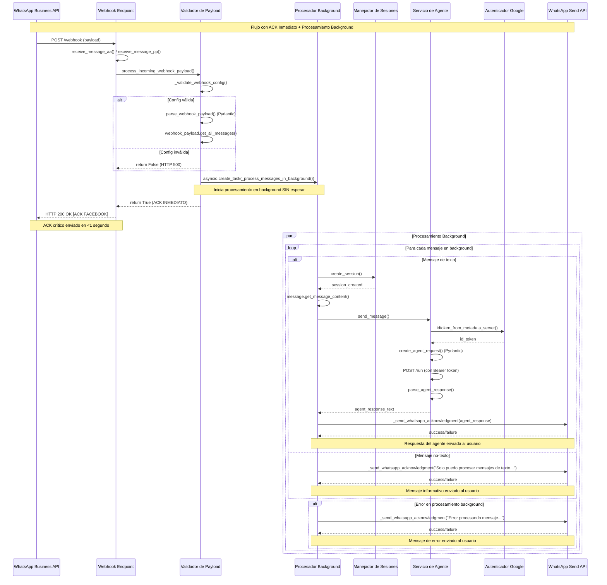
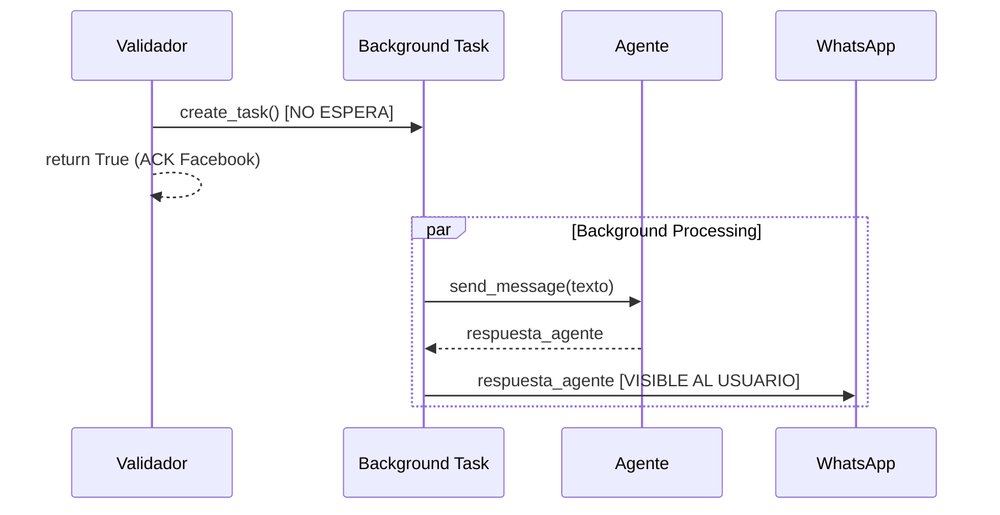

# Diagrama de Secuencia - Procesamiento de Mensajes WhatsApp

## 📋 Flujo Principal de Mensajes



## 🔧 Detalles Técnicos del Flujo

### 1. **Entrada del Webhook**
```
WhatsApp → receive_message_aa/pp() → process_incoming_webhook_payload() → ACK INMEDIATO (HTTP 200) + Background Processing
```

### 2. **ACK Inmediato a Facebook**
```
_validate_webhook_config() → parse_webhook_payload() → asyncio.create_task() → return True → HTTP 200
```

### 3. **Procesamiento Background Asíncrono**


## 📊 Componentes y Responsabilidades

### **Validador de Payload** (`process_incoming_webhook_payload`)
- ✅ Valida variables de entorno
- ✅ Parsea webhook con Pydantic
- ✅ **ACK inmediato** a Facebook (return True)
- ✅ Inicia procesamiento background con `asyncio.create_task()`

### **Procesador Background** (`_process_messages_in_background`)
- ✅ Procesa mensajes de forma asíncrona
- ✅ No bloquea el ACK a Facebook
- ✅ Maneja errores independientemente

### **Procesador de Mensajes de Texto** (`_process_single_text_message`)
1. **Crear sesión:** `create_session()`
2. **Extraer contenido:** `message.get_message_content()`
3. **Comunicar con agente:** `send_message()`
4. **Respuesta directa:** Respuesta del agente (ejecutado en background)

### **Procesador de Mensajes No-Texto** (`_process_non_text_message`)
1. **Mensaje informativo directo:** Explicación sobre solo texto (ejecutado en background)

### **Comunicación con Agente** (`send_message`)
1. **Mapeo de app:** `get_agent_app_name()`
2. **Autenticación:** Google ID token
3. **Request Pydantic:** `create_agent_request()`
4. **POST al agente:** `/run` endpoint
5. **Parse respuesta:** `parse_agent_response()`

## 🚀 Características del Sistema Actual

### ✅ **Optimizaciones**
- **ACK inmediato a Facebook** (<1 segundo) previene reenvíos de WhatsApp
- **Procesamiento background** sin bloquear respuesta HTTP
- **Sin timeouts** - Facebook recibe ACK inmediatamente
- **Procesamiento paralelo** con asyncio.create_task()
- **Solo modelos Pydantic** - código limpio
- **Manejo robusto de errores** con ACK garantizado
- **UX óptima:** Solo mensajes útiles al usuario

### ❌ **Sin Backward Compatibility**
- No hay procesamiento legacy
- No hay fallbacks de parsing
- No hay funciones de compatibilidad
- Falla limpiamente si no puede parsear

### 🔄 **Flujo Optimizado**
```
Webhook → Validar → Parsear → ACK INMEDIATO Facebook (HTTP 200) + Background Task → Procesar → Respuesta Usuario
```

## 📈 **Ventajas del Diseño Actual**

1. **Performance crítico:** ACK inmediato a Facebook (<1s) evita timeouts y reenvíos
2. **Escalabilidad:** Procesamiento background no bloquea nuevos webhooks
3. **Robustez:** Manejo de errores independiente en background
4. **Disponibilidad:** Sistema siempre responde rápido a Facebook
5. **Arquitectura moderna:** asyncio.create_task() para concurrencia
6. **UX óptima:** Solo mensajes útiles y relevantes al usuario
