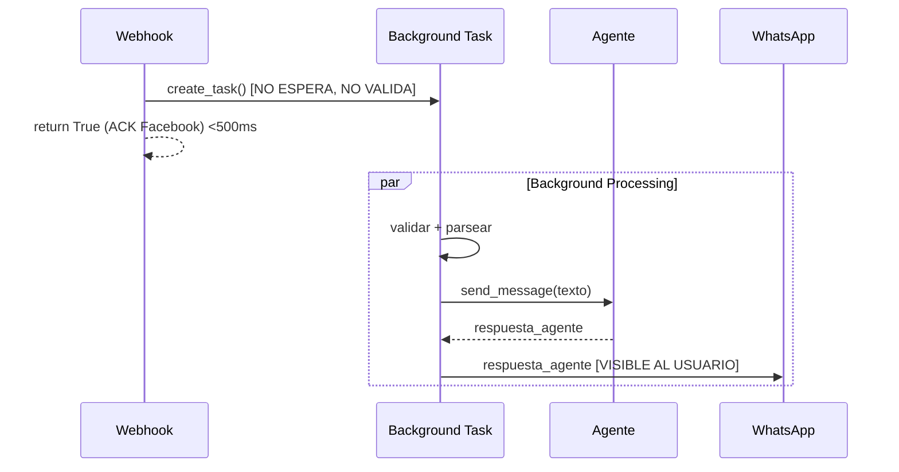

# Diagrama de Secuencia - Procesamiento de Mensajes WhatsApp

## 📋 Flujo Principal de Mensajes

```mermaid
sequenceDiagram
    participant WA as WhatsApp Business API
    participant WH as Webhook Endpoint
    participant BG as Procesador Background
    participant VP as Validador de Payload
    participant SM as Manejador de Sesiones
    participant AG as Servicio de Agente
    participant AU as Autenticador Google
    participant WS as WhatsApp Send API

    Note over WA, WS: Flujo ACK PRIMERO + Validación/Procesamiento Background

    %% 1. Recepción del webhook
    WA->>WH: POST /webhook (payload)
    WH->>WH: receive_message_aa() / receive_message_pp()
    WH->>WH: process_incoming_webhook_payload()

    %% 2. ACK INMEDIATO PRIMERO (sin validar nada)
    WH->>BG: asyncio.create_task(_process_webhook_in_background())
    Note over WH, BG: Inicia background SIN validar, SIN parsear
    WH-->>WA: HTTP 200 OK [ACK FACEBOOK INMEDIATO]
    Note over WH, WA: ACK crítico enviado en <500ms SIN validaciones

    %% 3. Validación y procesamiento en background (paralelo)
    par Background Processing
        BG->>VP: _validate_webhook_config()
        alt Config válida
            VP-->>BG: config válida
            BG->>BG: parse_webhook_payload() (Pydantic)
            BG->>BG: webhook_payload.get_all_messages()
            
            loop Para cada mensaje en background
                alt Mensaje de texto
                    BG->>SM: create_session()
                    SM-->>BG: session_created
                    
                    BG->>BG: message.get_message_content()
                    BG->>AG: send_message()
                    
                    %% Autenticación con el agente
                    AG->>AU: idtoken_from_metadata_server()
                    AU-->>AG: id_token
                    
                    %% Comunicación con agente
                    AG->>AG: create_agent_request() (Pydantic)
                    AG->>AG: POST /run (con Bearer token)
                    AG->>AG: parse_agent_response()
                    AG-->>BG: agent_response_text
                    
                    %% Envío de respuesta al usuario
                    BG->>WS: _send_whatsapp_acknowledgment(agent_response)
                    WS-->>BG: success/failure
                    Note over BG, WS: Respuesta del agente enviada al usuario
                    
                else Mensaje no-texto
                    %% Mensaje informativo directo
                    BG->>WS: _send_whatsapp_acknowledgment("Solo puedo procesar mensajes de texto...")
                    WS-->>BG: success/failure
                    Note over BG, WS: Mensaje informativo enviado al usuario
                end
                
                %% Manejo de errores en background
                alt Error en procesamiento background
                    BG->>WS: _send_whatsapp_acknowledgment("Error procesando mensaje...")
                    WS-->>BG: success/failure
                    Note over BG, WS: Mensaje de error enviado al usuario
                end
            end
        else Config inválida
            VP-->>BG: error config
            Note over BG: Termina background processing (ya se envió ACK)
        end
    end
```



## 🔧 Detalles Técnicos del Flujo

### 1. **ACK Inmediato (Sin Validaciones)**
```
WhatsApp → receive_message_aa/pp() → ACK INMEDIATO (HTTP 200) → asyncio.create_task(background)
```

### 2. **Validación y Parsing en Background**
```
Background Task → _validate_webhook_config() → parse_webhook_payload() → get_all_messages() → procesar
```

### 3. **Flujo Optimizado**


## 📊 Componentes y Responsabilidades

### **ACK Handler** (`process_incoming_webhook_payload`)
- ✅ **ACK inmediato** a Facebook (sin validaciones)
- ✅ Inicia background task con `asyncio.create_task()`
- ✅ **Siempre retorna True** para HTTP 200

### **Background Processor** (`_process_webhook_in_background`)
- ✅ Valida configuración en background
- ✅ Parsea webhook con Pydantic en background
- ✅ Maneja errores sin afectar ACK
- ✅ Procesa mensajes de forma asíncrona

### **Message Processor** (`_process_messages_in_background`)
- ✅ Procesa mensajes individualmente
- ✅ Manejo de errores por mensaje
- ✅ Envío de respuestas a usuarios

### **Procesador de Mensajes de Texto** (`_process_single_text_message`)
1. **Crear sesión:** `create_session()`
2. **Extraer contenido:** `message.get_message_content()`
3. **Comunicar con agente:** `send_message()`
4. **Respuesta directa:** Respuesta del agente (ejecutado en background)

### **Procesador de Mensajes No-Texto** (`_process_non_text_message`)
1. **Mensaje informativo directo:** Explicación sobre solo texto (ejecutado en background)

### **Comunicación con Agente** (`send_message`)
1. **Mapeo de app:** `get_agent_app_name()`
2. **Autenticación:** Google ID token
3. **Request Pydantic:** `create_agent_request()`
4. **POST al agente:** `/run` endpoint
5. **Parse respuesta:** `parse_agent_response()`

## 🚀 Características del Sistema Actual

### ✅ **Optimizaciones Críticas**
- **ACK ultra-rápido** (<500ms) sin validaciones previas
- **Sin riesgo de timeout** - ACK garantizado antes de cualquier procesamiento
- **Procesamiento completamente asíncrono** en background
- **Manejo robusto de errores** sin afectar ACK a Facebook
- **Zero downtime** - siempre responde a Facebook inmediatamente
- **Solo modelos Pydantic** en background processing
- **UX óptima:** Solo mensajes útiles al usuario

### ❌ **Sin Backward Compatibility**
- No hay procesamiento legacy
- No hay fallbacks de parsing
- No hay funciones de compatibilidad
- Falla limpiamente si no puede parsear

### 🔄 **Flujo Ultra-Optimizado**
```
Webhook → ACK INMEDIATO Facebook (HTTP 200) → Background: Validar → Parsear → Procesar → Respuesta Usuario
```

## 📈 **Ventajas del Diseño Actual**

1. **Performance ultra-crítico:** ACK a Facebook en <500ms sin validaciones
2. **Zero timeout risk:** Ninguna operación puede bloquear el ACK
3. **Máxima escalabilidad:** Procesamiento 100% asíncrono en background
4. **Robustez extrema:** Errores de config/parsing no afectan ACK
5. **Alta disponibilidad:** Sistema siempre responde inmediatamente a Facebook
6. **Arquitectura moderna:** Separación total entre ACK y procesamiento
7. **UX óptima:** Solo mensajes útiles y relevantes al usuario
